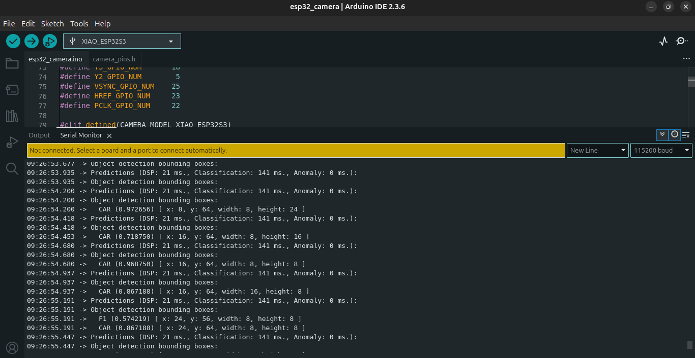

# ESP32 Camera Configuration for Edge Impulse

# 📷 EdgeImpulse + Seeed XIAO ESP32S3 Cam Integration

This project provides a working configuration for the **Seeed XIAO ESP32S3 Sense** board with camera to run Edge Impulse ML models — enabling real-time **image classification** directly on the device, with no cloud or internet needed.
## 🔧 Board Overview: Seeed XIAO ESP32S3 Sense

> 🧠 Perfect for AI-on-the-edge projects like traffic monitoring, gesture detection, and more.

---

## ✨ Features

- ✅ Fully working on **Seeed XIAO ESP32S3 Sense**
- 🎯 Compatible with **Edge Impulse Studio** (Arduino deployment)
- 📸 Uses onboard **OV2640 Camera**
- ⚙️ Optimized configuration for **camera-based ML models**
- 📡 Built-in WiFi support for optional cloud features

---

## 🧠 Why This Repo Exists

The official Edge Impulse examples were built for other ESP32-CAM boards. This repo was created to:
- Modify and adapt those examples for the **XIAO ESP32S3 + OV2640**
- Fix compatibility issues (pinouts, PSRAM, camera init)
- Enable smooth deployment of **Edge Impulse vision models**

---

## 🔧 Hardware Required

| Component                    | Description                        |
|-----------------------------|------------------------------------|
| 🧠 XIAO ESP32S3 Sense        | Dual-core, 8MB PSRAM, Wi-Fi, BLE   |
| 📷 OV2640 Camera Module      | Comes with Sense Hat               |
| 🔌 USB-C Cable               | For power and programming          |

---

## 🚀 Quick Start

1. copy the pin_configuration.h folder edit it your code after the libraries include section and you are done to go.
## 📸 Output Preview

